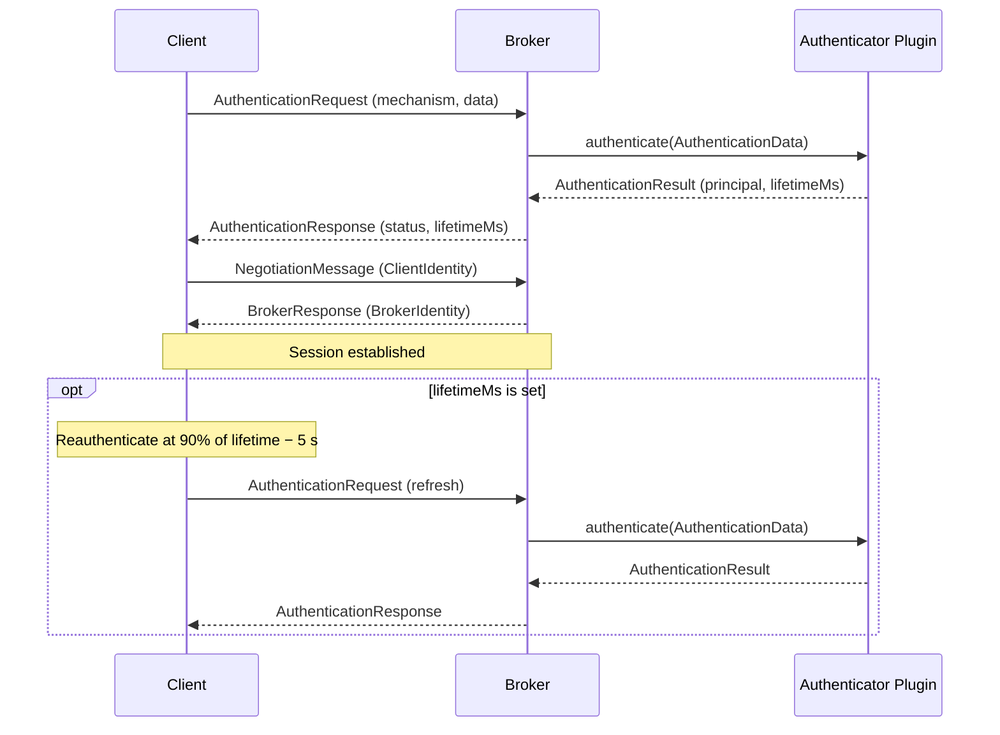

# Authentication
{: .no_toc }

* toc
{:toc}

## Introduction

BlazingMQ supports pluggable authentication so that brokers can verify the
identity of connecting clients before allowing them to produce or consume
messages.  Authentication happens at connection time, before session
negotiation, and optionally repeats on a configurable schedule to support
short-lived credentials such as tokens.

Key capabilities:

- **Mechanism-based dispatch** -- the broker routes each authentication request
  to the plugin registered for the requested mechanism (e.g. `BASIC`, `JWT`).
- **Session lifetime & reauthentication** -- plugins can return a lifetime with
  their result; the client SDK automatically reauthenticates before the
  credential expires.
- **Anonymous credential control** -- configurable policy for unauthenticated
  clients: accept them with a default identity, route them through an
  authenticator, or reject them entirely.
- **Asynchronous processing** -- authentication is performed in a dedicated,
  configurable authentication thread pool to avoid blocking other connections
  while validating credentials.

{: .important }
> Authentication is not enforced by default.  Without explicit configuration,
> unauthenticated clients are accepted as anonymous.  To require credentials
> for every client, configure an authenticator and set `anonymousCredential`
> to `disallow` (see [Configuration](#configuration)).

---

## How Authentication Works in BlazingMQ

The following sequence shows the authentication and negotiation flow when a
client connects to a broker:



1. The client sends an **`AuthenticationRequest`** containing the mechanism
   name (e.g. `"BASIC"`) and credential data (mechanism-specific binary
   payload).

2. The broker looks up the **authenticator plugin** registered for that
   mechanism and calls its `authenticate()` method in the authentication thread
   pool.

3. The plugin returns an **`AuthenticationResult`** with a human-readable
   `principal` and an optional `lifetimeMs`.

4. The broker sends an **`AuthenticationResponse`** back to the client.  On
   success, session negotiation proceeds.  On failure, the broker closes the
   connection (see [Failure Handling](#failure-handling) below).

5. If `lifetimeMs` is present, the client SDK schedules reauthentication at
   **90 % of the lifetime minus 5 seconds** to ensure the credential is
   refreshed before it expires.

Clients that do not support authentication, or are not configured to
authenticate, are handled by the **anonymous credential** path (see
[Configuration](#configuration) below).

### Failure Handling

**Initial authentication failure.**  When credentials are rejected, the broker
closes the connection.  The SDK automatically reconnects and retries until it
succeeds or the attempt limit is reached (unlimited by default).

**Reauthentication failure.**  The broker closes the connection if a
reauthentication attempt is rejected or if the client does not reauthenticate
before its credential expires.  The SDK reconnects and retries as above.

---

## Configuration

Authentication is configured in the broker configuration file
(`bmqbrkcfg.json`) under the `appConfig.authentication` key.

### Schema overview

```json
{
  "appConfig": {
    "authentication": {
      "authenticators": [
        {
          "name": "<plugin-name>",
          "settings": [
            { "key": "<key>", "value": { "stringVal": "<val>" } }
          ]
        }
      ],
      "anonymousCredential": { ... },
      "minThreads": 1,
      "maxThreads": 8
    }
  }
}
```

| Field | Description |
|-------|-------------|
| `authenticators` | List of authenticator plugin configurations.  Each entry names a plugin and provides its settings.  All plugins must have unique mechanisms. |
| `anonymousCredential` | Controls what happens when a client does not authenticate.  See below. |
| `minThreads` | Minimum number of threads in the authentication thread pool (default: 1). |
| `maxThreads` | Maximum number of threads in the authentication thread pool (default: 8). |

### Anonymous credential

The `anonymousCredential` field is a choice between two options:

| Option | Effect |
|--------|--------|
| `"disallow": {}` | Reject all unauthenticated clients.  Every client **must** authenticate. |
| `"credential": { "mechanism": "<m>", "identity": "<id>" }` | Authenticate unauthenticated clients using the given mechanism and identity.  The broker forwards the identity to the matching authenticator plugin as if the client had sent it. |

When `anonymousCredential` is **omitted entirely**, the built-in
`AnonAuthenticator` is used and all unauthenticated connections are accepted
with the principal `"anonymous"`.

### Example: Basic authenticator with two users

```json
{
  "appConfig": {
    "authentication": {
      "authenticators": [
        {
          "name": "BasicAuthenticator",
          "settings": [
            { "key": "alice", "value": { "stringVal": "s3cret" } },
            { "key": "bob",   "value": { "stringVal": "hunter2" } }
          ]
        }
      ],
      "anonymousCredential": { "disallow": {} }
    }
  }
}
```

This configuration:

- Enables the built-in `BasicAuthenticator` with credentials for `alice` and
  `bob`.
- Disallows anonymous connections -- every client must authenticate with a
  valid username and password.

### Example: external plugin authenticator

```json
{
  "appConfig": {
    "plugins": {
      "libraries": ["/opt/bmq/plugins/"],
      "enabled": ["MyJwtAuthenticator"]
    },
    "authentication": {
      "authenticators": [
        {
          "name": "MyJwtAuthenticator",
          "settings": [
            { "key": "issuer", "value": { "stringVal": "https://auth.example.com" } },
            { "key": "audience", "value": { "stringVal": "blazingmq" } }
          ]
        }
      ],
      "anonymousCredential": { "disallow": {} }
    }
  }
}
```

---

## Built-in Authenticators

BlazingMQ ships with two built-in authenticator plugins.

### AnonAuthenticator

| Property | Value |
|----------|-------|
| Plugin name | `AnonAuthenticator` |
| Mechanism | N/A |
| Credential format | N/A |
| Session lifetime | None (no reauthentication) |

The anonymous authenticator always succeeds and returns the principal
`"anonymous"`.  It is used as the default when no `anonymousCredential` is
configured and a client connects without authenticating.

### BasicAuthenticator

| Property | Value |
|----------|-------|
| Plugin name | `BasicAuthenticator` |
| Mechanism | `BASIC` |
| Credential format | `username:password` (UTF-8 bytes) |
| Session lifetime | 600 seconds (10 minutes), then reauthentication is required |

Settings are key-value pairs where the key is the username and the value is the
password (as a `stringVal`).

{: .note }
> The colon character (`:`) is not allowed in usernames but is accepted in
> passwords.  The authenticator splits the credential payload on the **first**
> colon.

---

## Writing a Custom Authenticator Plugin

Custom authenticators are dynamically loaded shared libraries.  A plugin
provides three pieces:

1. An **`Authenticator`** -- subclass of `mqbplug::Authenticator` that
   implements `authenticate()`, `name()`, `mechanism()`, `start()`, and
   `stop()`.
2. An **`AuthenticatorPluginFactory`** -- creates instances of your
   authenticator.
3. A **`PluginLibrary`** -- exports the `instantiatePluginLibrary` C symbol
   so the broker can load the plugin via `dlopen`.

See
[`mqbplug_authenticator.h`](https://github.com/bloomberg/blazingmq/blob/main/src/groups/mqb/mqbplug/mqbplug_authenticator.h)
for the full interface documentation.  The built-in
[`BasicAuthenticator`](https://github.com/bloomberg/blazingmq/blob/main/src/groups/mqb/mqbauthn/mqbauthn_basicauthenticator.cpp)
and
[`AnonAuthenticator`](https://github.com/bloomberg/blazingmq/blob/main/src/groups/mqb/mqbauthn/mqbauthn_anonauthenticator.cpp)
serve as working reference implementations.

A few things to keep in mind:

{: .important }
> `authenticate()` is called from the broker's authentication thread pool.
> Your implementation **must be thread-safe** (the method is `const`).

- The `authenticate()` method receives the raw credential bytes and the
  client's IP address.  On success, return 0 and populate the result with a
  `principal` and an optional `lifetimeMs`.  On failure, return non-zero and
  write a reason to `errorDescription`.

- Plugin settings are passed as key-value pairs from the broker config.  Use
  `AuthenticatorUtil::findAuthenticatorConfig()` to look up your plugin's
  config by name.

### Deploying a plugin

Compile the plugin as a shared library (`.so` / `.dylib`) and configure the
broker to load it:

```json
{
  "appConfig": {
    "plugins": {
      "libraries": ["/path/to/plugin/directory/"],
      "enabled": ["MyAuthenticator"]
    },
    "authentication": {
      "authenticators": [
        {
          "name": "MyAuthenticator",
          "settings": []
        }
      ]
    }
  }
}
```

---

## Client-Side Integration

### C++ SDK

Clients authenticate by providing an authentication credential callback through
the session options.  The callback supplies an `AuthnCredential` containing the
mechanism name and credential data.

```cpp
#include <bmqt_sessionoptions.h>
#include <bmqt_authncredential.h>

bmqt::SessionOptions options;

// Set the authentication credential callback
options.setAuthCredentialCallback(
    [](bmqt::AuthnCredential* credential) {
        credential->setMechanism("BASIC");

        bsl::string data = "alice:s3cret";
        credential->setData(
            bsl::vector<char>(data.begin(), data.end()));
    });

bmqa::Session session(options);
session.start();
```

Reauthentication is handled transparently by the SDK.  When the broker returns
a `lifetimeMs` in the authentication response, the SDK automatically invokes
the credential callback again before the credential expires.

### Java and Python SDKs

Authentication support in the Java and Python SDKs is not yet available.

---
